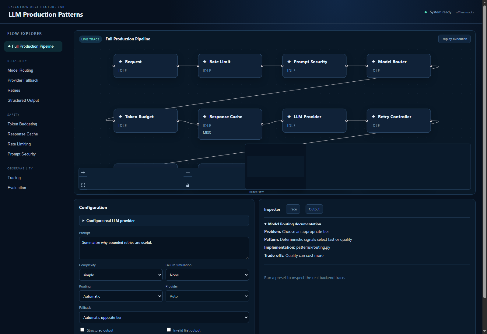
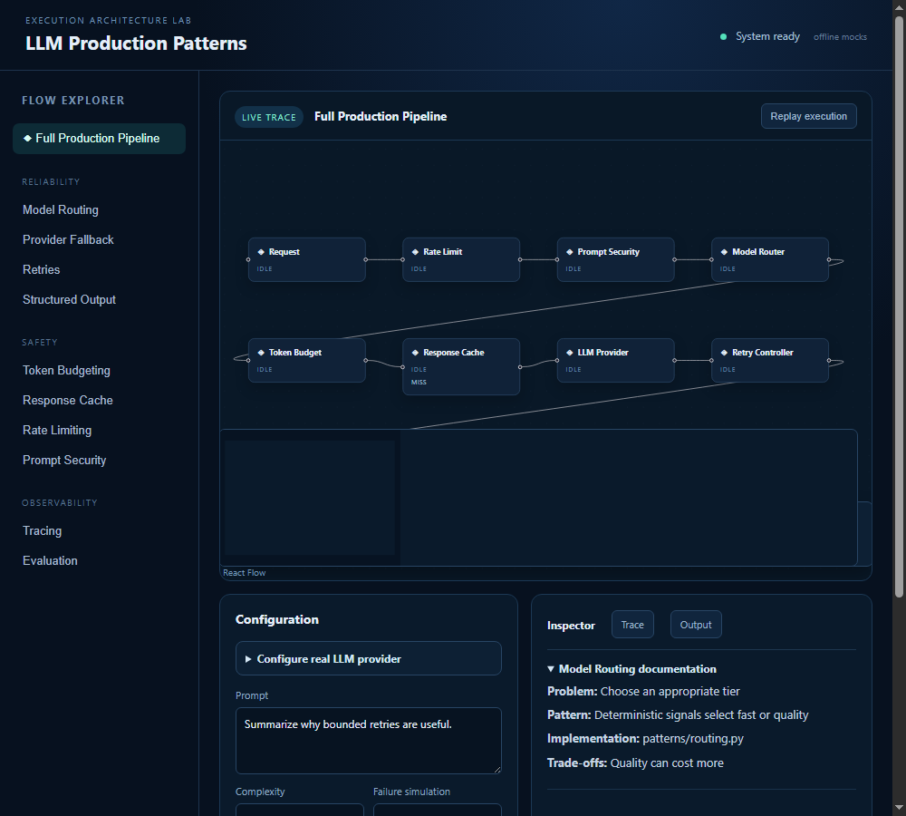
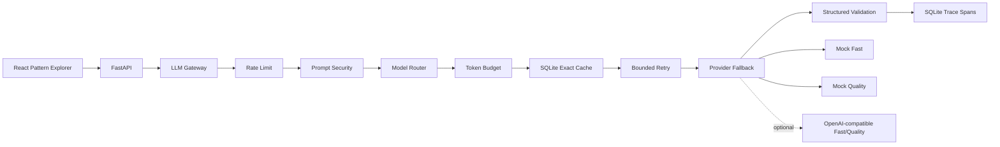

# LLM Production Patterns

LLM Production Patterns is a local-first, inspectable reference system for the engineering boundaries that turn a model call into a reliable application workflow.

It makes routing, retries, fallback, structured validation, token budgeting, caching, rate limiting, prompt security, tracing, and deterministic evaluation executable and visible. The default setup runs offline with deterministic mock providers. An OpenAI-compatible transport can be configured from the interface or environment when real model calls are needed.

## Product capabilities

- **Inspectable execution:** a React + XYFlow canvas mirrors the backend trace, including the selected provider path, skipped stages, retries, fallback, cache hits, security blocks, and structured correction.
- **Pattern explorer:** focused presets make each production pattern runnable without building an arbitrary workflow editor.
- **Provider routing:** automatic Fast/Quality routing, fixed provider selection, ordered fallback, and provider discovery through a typed API.
- **Real LLM configuration:** add an OpenAI-compatible Base URL, API key, default model, Fast model, and Quality model directly in the UI.
- **Safety and cost boundaries:** token budgets, local token-bucket limits, exact SQLite caching, and prompt-injection heuristics execute before provider work.
- **Operational evidence:** persisted trace IDs and ordered spans expose why a request took its path.
- **Repeatable quality gates:** 14 backend tests, frontend mapping tests, Ruff, TypeScript validation, a production build, and a deterministic ten-case evaluation suite.

## Product screenshots

### Desktop execution workspace

The desktop view keeps the pattern explorer, live execution graph, configuration, and inspector visible together.



### Responsive execution workspace

The same local application adapts to a narrower viewport while retaining the workflow graph and diagnostics.



These captures were generated from the running local frontend and inspected after the React Flow theme was applied. They show the actual application surface, not mock README artwork.

## Architecture



The gateway is the backend authority. The frontend renders the returned trace and does not independently decide which provider ran. The order is deliberate: rate limiting and security happen before cache lookup; routing and budgeting determine provider identity and context; validation happens before a response is cached.

## Patterns at a glance

| Pattern | Question it answers | Implementation |
| --- | --- | --- |
| Model routing | Which tier should handle this request? | Deterministic complexity and token signals |
| Provider fallback | What happens when a provider fails? | Ordered recognized-error fallback |
| Retries | Which transient failures are worth retrying? | Bounded exponential backoff |
| Structured output | How is model output made typed? | Pydantic validation plus one correction |
| Token budgeting | What fits safely in context? | Protected prompt and priority-aware trimming |
| Response caching | How is repeated work avoided? | Exact SQLite key with TTL |
| Rate limiting | How is request volume bounded? | Per-client in-memory token bucket |
| Prompt security | How are unsafe instructions constrained? | Operation allowlist and heuristic detection |
| Tracing | Why did a request take this path? | Persisted trace ID and ordered spans |
| Deterministic evaluation | How are regressions caught offline? | Fixture-driven assertions without an LLM judge |

## Request lifecycle

1. A typed request enters FastAPI and receives a trace ID.
2. The client bucket is consumed before any cache shortcut.
3. Prompt security checks the operation and suspicious patterns.
4. The router selects Fast or Quality, unless fixed routing explicitly overrides it.
5. Protected input and retained context are fitted into the token budget.
6. The exact request identity is checked in SQLite.
7. The selected provider runs through bounded retries and ordered fallback.
8. Structured output is validated and receives at most one correction request.
9. The successful payload is cached, persisted with its spans, and returned to the UI.

## Run locally

Requirements: Python 3.12+, Node.js 20+, and npm 10+.

### Windows PowerShell

```powershell
git clone https://github.com/PdrPaez/llm-production-patterns.git
cd llm-production-patterns

python -m venv backend\.venv
backend\.venv\Scripts\Activate.ps1
python -m pip install --upgrade pip
python -m pip install -e ".\backend[dev]"

cd frontend
npm ci
```

Use two terminals from the repository root.

Backend:

```powershell
cd backend
.venv\Scripts\Activate.ps1
python -m uvicorn app.main:app --reload --host 127.0.0.1 --port 8000
```

Frontend:

```powershell
cd frontend
npm run dev -- --host 127.0.0.1
```

Open `http://127.0.0.1:5173`. The backend is available at `http://127.0.0.1:8000`.

## Use a real LLM API

The default mode is offline mock execution. To configure a real provider without editing source code, expand **Configure real LLM provider** in the interface and enter:

- Base URL, normally `https://api.openai.com/v1`;
- API key;
- default model;
- optional Fast and Quality model overrides.

Click **Connect provider**, change Routing to **Fixed** if you want to choose a specific discovered provider, or leave Automatic to let complexity select Fast or Quality. The key is sent only to the backend, cleared from the form after submission, kept in backend memory for the current session, and never returned by provider discovery or trace responses.

For environment-based deployments, copy the example file from the repository root:

```powershell
Copy-Item .env.example .env
```

Then set `LLM_PROVIDER_MODE=openai_compatible` and `OPENAI_API_KEY`. Optional variables are `OPENAI_BASE_URL`, `OPENAI_MODEL`, `OPENAI_FAST_MODEL`, and `OPENAI_QUALITY_MODEL`. Restart the backend after changing the file. Any OpenAI-compatible gateway can be used by changing `OPENAI_BASE_URL`.

## How to use the explorer

1. Run **Full Production Pipeline** and inspect the live trace.
2. Choose **Model Routing** with high complexity to see the Quality route and routing reason.
3. Choose **Retries** to observe a transient failure and bounded backoff.
4. Choose **Provider Fallback** to keep the failed primary visible while the fallback succeeds.
5. Choose **Structured Output** to inspect validation and one correction.
6. Run the same cache-enabled request twice to see a cache hit with zero provider calls.
7. Choose **Prompt Security** to see downstream stages skipped without a provider call.
8. Choose **Evaluation** to run the deterministic regression suite.

Selecting a node opens its metadata in the inspector. **Replay execution** replays the backend trace and does not fabricate an independent animation.

## API reference

| Method | Route | Purpose |
| --- | --- | --- |
| GET | `/health` | Service and provider mode health |
| GET | `/api/patterns` | Pattern descriptions used by the explorer |
| GET | `/api/providers` | Safe provider descriptors and availability |
| POST | `/api/providers/configure` | Configure an OpenAI-compatible provider for the current backend session |
| POST | `/api/playground/run` | Execute the production-pattern gateway |
| GET | `/api/traces/{trace_id}` | Retrieve persisted execution output and spans |
| POST | `/api/evaluation/run` | Run the deterministic dataset |
| GET | `/api/cache/stats` | Read cache counters |
| DELETE | `/api/cache` | Clear cached responses without removing traces |

Example playground request:

```powershell
$body = @{ prompt = "Explain bounded retries"; complexity = "simple" } | ConvertTo-Json
Invoke-RestMethod -Method Post `
  -Uri http://127.0.0.1:8000/api/playground/run `
  -ContentType "application/json" `
  -Body $body
```

## Configuration

The built-in defaults work without copying `.env.example`.

| Variable | Default | Description |
| --- | --- | --- |
| `LLM_PROVIDER_MODE` | `mock` | `mock` or `openai_compatible` |
| `OPENAI_API_KEY` | empty | Provider credential; never included in API responses |
| `OPENAI_BASE_URL` | `https://api.openai.com/v1` | OpenAI-compatible `/v1` endpoint |
| `OPENAI_MODEL` | `gpt-4o-mini` | Default external model |
| `OPENAI_FAST_MODEL` | empty | Optional Fast-tier override |
| `OPENAI_QUALITY_MODEL` | empty | Optional Quality-tier override |
| `DATABASE_URL` | `sqlite:///./data/app.db` | Local persistence |
| `PROVIDER_MAX_ATTEMPTS` | `3` | Total attempts including the first call |
| `RETRY_BASE_DELAY_MS` | `50` | Exponential backoff base |
| `DEFAULT_MAX_CONTEXT_TOKENS` | `1024` | Approximate input budget |
| `DEFAULT_RESERVED_OUTPUT_TOKENS` | `256` | Reserved output space |
| `CACHE_TTL_SECONDS` | `300` | Cache lifetime |
| `RATE_LIMIT_CAPACITY` | `5` | Initial client bucket capacity |
| `RATE_LIMIT_REFILL_PER_SECOND` | `1` | Bucket refill rate |

## Evaluation and validation

The committed dataset covers routing, structured output, retries, fallback, budgets, cache, rate limiting, security, and tracing. Run the complete local gate:

```powershell
cd backend
python -m ruff check .
python -m pytest -q
python -m app.evaluation.run

cd ..\frontend
npm ci
npm run test
npm run lint
npm run build
```

The evaluation is intentionally deterministic and does not claim to measure general model quality. Real-provider transport behavior is tested with an HTTP mock, including structured requests and transient HTTP failures; no credential or paid API is required for the test suite.

## Repository layout

```text
backend/
  app/
    evaluation/       deterministic dataset and runner
    patterns/         routing, retries, fallback, cache, security, tracing
    providers/        protocol, deterministic mocks, OpenAI-compatible transport
    gateway.py        ordered production-pattern composition
    main.py           FastAPI application and routes
  tests/              backend unit and integration coverage
frontend/
  src/
    api/              typed backend client
    flow/             templates, graph mapping, and execution tests
    main.tsx          explorer UI and provider settings form
    *.css             application and React Flow theme
docs/
  assets/             real local application screenshots
  spec-validation.md  requirement-to-evidence audit
  *.md                architecture, lifecycle, patterns, and decisions
```

## Architecture decisions and limitations

- SQLite keeps cache and traces inspectable on a developer machine; it is not a distributed store.
- The limiter is single-process; use a distributed limiter at scale.
- Prompt security is defense in depth, not a complete prompt-injection solution.
- Token counts use a documented approximation unless a provider-specific tokenizer is added.
- The OpenAI-compatible session configuration is intentionally in-memory. Add an authenticated secret manager before making it multi-user or persistent.
- The deterministic mock provider is useful for development and regression checks, not a substitute for production model evaluation.
- The project is a reference implementation, not a full proxy, agent framework, RAG system, workflow automation product, or distributed gateway.

The full requirement audit is available in [docs/spec-validation.md](docs/spec-validation.md). The implementation roadmap and Git workflow are in [ROADMAP.md](ROADMAP.md).

## Security model

API keys are accepted only by the configuration endpoint, held in backend memory, and excluded from descriptors, traces, and responses. External calls use the configured Base URL and bearer authorization. Prompt checks run before cache lookup, and configuration errors are not silently retried. Review the limitations before exposing the service beyond a trusted local environment.

## Contribution workflow

Use:

```text
feature/LPP-XXX-description -> dev -> main
```

Commits follow:

```text
[AREA][LPP-XXX] concise description
```

Before promotion, run backend Ruff/tests/evaluation and frontend tests/lint/build. Update the relevant documentation whenever behavior or API contracts change.

## License

MIT. See [LICENSE](LICENSE).
