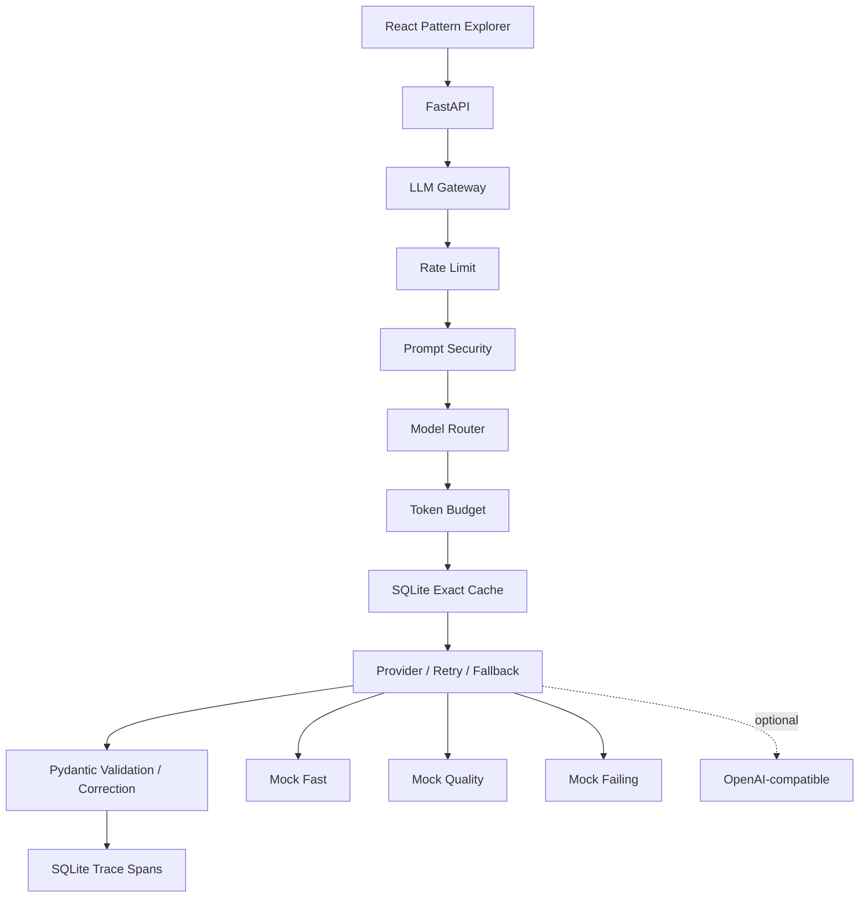

# LLM Production Patterns

Small, executable reference implementations of engineering patterns that become important when LLM integrations move from prototype to production.

Calling an LLM API is easy. Handling failures, model selection, invalid outputs, token limits, caching, rate limits, security boundaries, observability, and evaluation is where much of the engineering begins. This repository focuses on those concerns through deliberately small implementations that can be inspected, executed, tested, and visually explored.

The default system is deterministic and offline. No API key, paid API, database server, or external LLM is required.

## Patterns

| Pattern | Problem | Implementation |
| --- | --- | --- |
| Model routing | Cost/quality trade-off | Deterministic routing rules |
| Provider fallback | Provider availability | Ordered provider chain |
| Retries | Transient failures | Bounded exponential backoff |
| Structured output | Unreliable output shape | Pydantic validation and one correction |
| Token budgeting | Finite context | Protected input and bounded context |
| Response caching | Repeated work | SQLite TTL exact cache |
| Rate limiting | Overload/cost | Local token bucket |
| Prompt injection | Untrusted instructions | Heuristic defense-in-depth controls |
| Tracing | Debugging flows | Lightweight persisted trace/span model |
| Evaluation | Regression detection | Deterministic local dataset |

## Architecture



The request order is deliberate: rate limiting happens before cache so cached requests still consume quota; security happens before cache so unsafe input cannot bypass controls; routing and budgeting happen before cache identity; validation happens before cache store.

## Visual execution explorer

The frontend renders the actual backend execution path with XYFlow. It exposes provider choices, routing reasons, retries, fallback, cache bypass, structured correction, security blocks, and measured trace timings. The graph is driven by the returned trace; it does not independently decide routing or fabricate execution. Presets are safe, fixed demonstrations rather than an arbitrary workflow builder.

Available flows include automatic routing, fixed provider selection, Fast → Quality fallback, Quality → Fast fallback, retry simulation, structured correction, cache, rate limiting, prompt security, tracing, and deterministic evaluation.

## Run locally

Backend (PowerShell):

```powershell
cd backend
python -m venv .venv
.\.venv\Scripts\Activate.ps1
pip install -e ".[dev]"
uvicorn app.main:app --reload
```

Frontend, in another terminal:

```powershell
cd frontend
npm ci
npm run dev
```

Open `http://localhost:5173`. The API is available at `http://localhost:8000`.

### Use a real LLM API

The OpenAI-compatible transport is opt-in. From the repository root, copy the example configuration and set the provider mode and credential:

```powershell
Copy-Item .env.example .env
$env:LLM_PROVIDER_MODE = "openai_compatible"
$env:OPENAI_API_KEY = "your-key"
```

For a compatible gateway, set `OPENAI_BASE_URL` to its `/v1` endpoint. `OPENAI_MODEL` is the default model; `OPENAI_FAST_MODEL` and `OPENAI_QUALITY_MODEL` can override the two automatically selected tiers. Restart the backend after changing configuration. Alternatively, open `Configure real LLM provider` in the UI, fill in the Base URL, API key, and models, then select the discovered Fast or Quality provider. UI configuration is held in backend memory for the current session; the key is cleared from the form after submission and never returned by the API. `GET /api/providers` reports only safe metadata. Automatic routing maps simple requests to Fast and complex/structured requests to Quality. Timeouts, network failures, HTTP 429, and 5xx responses enter the existing bounded retry/fallback path.

## API and evaluation

The API exposes `GET /health`, `GET /api/patterns`, `GET /api/providers`, `POST /api/playground/run`, `GET /api/traces/{trace_id}`, `POST /api/evaluation/run`, `GET /api/cache/stats`, and `DELETE /api/cache`. Run the deterministic CLI from `backend` with `python -m app.evaluation.run`.

Routing is deterministic: structured output, high complexity, or large estimated input selects quality; otherwise fast is selected. Fixed mode reports `routing_overridden`. Only transient and unavailable provider errors are eligible for retry/fallback; malformed client input, validation failure, configuration errors, security blocks, and programming errors are not silently routed around. Retries are three total attempts with `base * 2^(attempt - 1)` delays and no final-failure sleep.

Structured output uses `SupportTicketAnalysis`; invalid output receives one correction request and one second validation. Token estimates are documented approximations (`characters / 4`), with protected prompt content and reserved output space. Cache identity is exact and includes provider and relevant settings; it has TTL and is not semantic caching. The token bucket is keyed by client and emits HTTP 429 plus `Retry-After` when exhausted.

Prompt security uses an operation allowlist and suspicious-pattern heuristics. It reduces risk but does not solve prompt injection. Tracing persists a trace ID and ordered spans locally. Evaluation uses fixture expectations and no LLM judge, so it is deterministic regression coverage rather than a quality benchmark.

## Demo walkthrough

1. Run Full Production Pipeline and inspect the real timeline.
2. Choose Model Routing with high complexity and inspect the quality reason.
3. Choose Retries and observe transient failure plus backoff.
4. Choose Provider Fallback and observe the failed primary remain visible.
5. Choose Structured Output and observe validation/correction.
6. Run the same normal request twice to observe cache hit and zero provider calls.
7. Choose Prompt Security and confirm downstream nodes are skipped.
8. Choose Evaluation to run the deterministic dataset.

## What this repository is not

It is not an agent framework, RAG system, LLM proxy product, workflow automation platform, n8n clone, security product, full production gateway, distributed rate limiter, or observability platform. It deliberately does not add RAG, embeddings, agents, queues, Redis, PostgreSQL, Kafka, Kubernetes, vector databases, or cloud deployment.

## Trade-offs

SQLite cache and local tracing are not distributed. The limiter is single-process. Heuristic prompt detection is incomplete. Approximate token counts differ from provider counts. Mock output does not represent real model quality. Fallback may change quality and cost. Concurrent identical cache misses may duplicate provider work. Production evolution is documented in `docs/decisions.md` without implementing those external systems.

## Roadmap and Git

See [ROADMAP.md](ROADMAP.md) for the LPP card sequence. Use `feature/LPP-XXX-description -> dev -> main` with commits in the form `[AREA][LPP-XXX] concise English description`. No automated-authorship metadata is added.

The concise source-level reference is [docs/patterns.md](docs/patterns.md).

## License

MIT.
